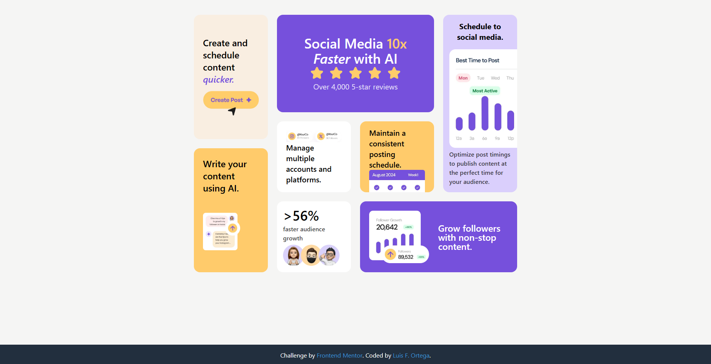

# Frontend Mentor - Bento grid solution

This is a solution to the [Bento grid challenge on Frontend Mentor](https://www.frontendmentor.io/challenges/bento-grid-RMydElrlOj). Frontend Mentor challenges help you improve your coding skills by building realistic projects. 

## Table of contents

- [Overview](#overview)
  - [The challenge](#the-challenge)
  - [Screenshot](#screenshot)
  - [Links](#links)
- [My process](#my-process)
  - [Built with](#built-with)
  - [Useful resources](#useful-resources)
- [Author](#author)

## Overview

### The challenge

Users should be able to:

- View the optimal layout for the interface depending on their device's screen size

### Screenshot

### Links

- Solution URL: [solution URL](https://your-solution-url.com)
- Live Site URL: [live site URL](https://github.com/LuisOrtega27/bento-grid-main)

### Built with

- Semantic HTML5 markup
- CSS custom properties
- Flexbox
- CSS Grid
- Mobile-first workflow
- [Tailwind](https://tailwindcss.com) - CSS Framework

### Useful resources

- [Tailwind official website](https://tailwindcss.com)

## Author

- portfolio - [Luis F. Ortega](https://luisortega27.github.io/portfolio/)
- Frontend Mentor - [@LuisOrtega27](https://www.frontendmentor.io/profile/LuisOrtega27)
- Linkedin - [Luis Ortega](https://www.linkedin.com/in/luis-ortega-408127243/)
